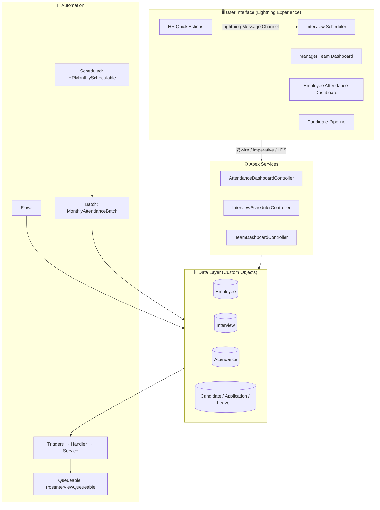
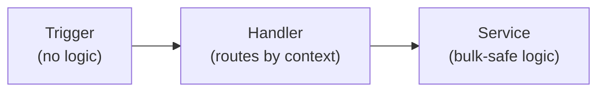
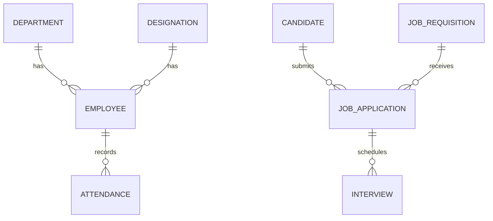

<div align="center">

# 🧑‍💼 HR Work Management System

### A full-stack HR platform on Salesforce: recruitment, attendance and leave in one place


[Overview](#-overview) · [Architecture](#-architecture) · [Data Model](#-data-model) · [Build Phases](#-build-phases-step-by-step) · [Screenshots](#-screenshots) · [Skills](#-skills-demonstrated) · [Setup](#-setup--deployment) · [Interview Notes](#-design-decisions--interview-notes)

</div>

---

## 📌 Overview

HR teams often track hiring, attendance and leave across separate spreadsheets. This project brings everything into one Salesforce application with:

| Area | What it does |
|---|---|
| 🧾 **Employee management** | Employees, departments and designations with clean, validated data |
| 🎯 **Recruitment** | Job requisitions, candidates, job applications and interview scheduling |
| 🗓️ **Attendance** | Daily attendance with duplicate protection and monthly percentage reports |
| 🌴 **Leave** | Leave requests with pending-approval visibility for managers |
| 📊 **Dashboards** | Custom Lightning Web Components for employees, managers and HR |
| ⚙️ **Automation** | Flow for simple rules, Apex for volume, control and cross-record logic |

> **Guiding principle:** use declarative tools (Flow, validation rules) first, and move to Apex only when volume, aggregate queries or multi-step chaining genuinely require it.

---

## 🏗️ Architecture



### Trigger pattern used on every object



**Why:** the trigger stays tiny, the handler decides *when*, and the service decides *what*. This keeps code testable, readable and safe for 200-record batches.

---

## 🗂️ Data Model

> ⚠️ **[fill in / verify]** Confirm the relationships below against **Setup → Schema Builder**, then replace this diagram with a screenshot at `docs/images/data-model.png`.



### Key custom fields

| Object | Field (API name) | Purpose |
|---|---|---|
| Attendance | `Employee__c` | Lookup to the employee |
| Attendance | `Attendence_Date__c` | Date of attendance |
| Attendance | `Status__c` | Present, Absent, Leave, Late, Work From Home |
| Interview | `Interview_Date__c`, `Start_Time__c`, `End_Time__c` | Scheduling |
| Interview | `Status__c` | Scheduled, Completed, ... |
| Employee | `Email__c` | Unique, lower-cased by trigger |

### Validation rules

| Object | Rule | Behaviour |
|---|---|---|
| Interview | Past-date check | Blocks a past date **only on create or when the date changes** (`ISNEW()` / `ISCHANGED()`), so later system updates are not blocked |
| Interview | Time check | End time must be after start time |

---

## 🪜 Build Phases (Step by Step)

<details>
<summary><b>Phases 1 to 18: Foundation, data model, security, Flow, reports</b> (click to expand)</summary>

> **[fill in]** One short paragraph per phase: what you built, which tool you used, and the result. Examples: object creation, relationships, page layouts, validation rules, Flows, reports and dashboards, permission sets.

</details>

<details open>
<summary><b>Phase 19: Apex Triggers (Trigger → Handler → Service)</b></summary>

**Goal:** add trigger automation only where it is clearly better than Flow.

| Step | Object | What was built |
|---|---|---|
| 1 | Employee | `EmployeeTrigger` → `EmployeeTriggerHandler` → `EmployeeService`: trims and lower-cases email, blocks duplicate emails (database and within the same batch) |
| 2 | Interview | `InterviewTrigger` → `InterviewTriggerHandler` → `InterviewService`: a scheduled interview must have a date |
| 3 | Attendance | `AttendanceTrigger` → `AttendanceTriggerHandler` → `AttendanceService`: one attendance record per employee per date, plus helper methods for working hours and monthly percentage |

**Bulkification rules followed**
- Always process the whole `Trigger.new` list, never one record
- One SOQL query per method, no queries or DML inside loops
- Maps and Sets used for lookups and duplicate detection

**Checkpoint passed ✅:** inserting **200 Attendance records** used **2 SOQL queries out of 100**.

**Challenge solved:** a field API name mismatch (`Attendence_Date__c` vs `Attendance_Date__c`) caused compile errors. Lesson: always copy API names from Object Manager.

</details>

<details open>
<summary><b>Phase 20: Advanced Apex (Batch, Queueable, Scheduled)</b></summary>

**Goal:** use asynchronous Apex only where the workload genuinely calls for it.

| Class | Type | Purpose |
|---|---|---|
| `MonthlyAttendanceBatch` | Batch Apex | Processes last month's attendance for **all** employees in chunks of 200 using one grouped query per chunk; `Database.Stateful` keeps running totals |
| `PostInterviewQueueable` | Queueable Apex | Chains three steps (notify → update → log), each in its own transaction with fresh limits |
| `HRMonthlySchedulable` | Scheduled Apex | Starts the batch at 1:00 AM on the 1st of every month (`0 0 1 1 * ?`) |

**Why Flow was not the right tool**

| Tool | Reason Flow fell short |
|---|---|
| Batch | Scheduled Flows struggle with very large volumes, cannot aggregate by employee and status in one query, and give no chunk-level control |
| Queueable | Flow cannot easily chain steps as separate transactions that each get fresh governor limits |
| Scheduled | A Scheduled Flow is fine for simple updates, but here the job only needs to launch a Batch with a custom chunk size |

**Checkpoint passed ✅:** `MonthlyAttendanceBatch` shows **Completed, 0 failures** in Setup → Apex Jobs.

**Challenge solved:** the Queueable's update step failed on the "Interview Date cannot be in the past" validation rule. Fixed in two ways:
1. `Database.update(records, false)` allows partial success, so one bad record cannot break the chain
2. The validation rule now fires only on create or date change

</details>

<details open>
<summary><b>Phase 21: Lightning Web Components</b></summary>

**Goal:** build a small number of genuinely useful custom UI components.

| Component | Placed on | Technique shown |
|---|---|---|
| `employeeAttendanceDashboard` | Employee record page | `@wire` with a cacheable Apex method, `@api recordId`, progress bar, month selector |
| `interviewScheduler` | HR Hub app page | Imperative Apex save, inline validation (`setCustomValidity`), toast errors, custom event |
| `hrQuickActions` | HR Hub app page | `NavigationMixin`, Lightning Message Channel to the scheduler |
| `candidatePipeline` | Candidate record page | Lightning Data Service (`getRecord`, `updateRecord`, `getPicklistValues`), path indicator |
| `managerTeamDashboard` | HR Hub app page | Four independent `@wire` sections, `refreshApex`, navigation to records |

**Every component handles three states:** loading spinner, empty state and a friendly error message.

**Checkpoint passed ✅:** components render live org data on a Lightning App Page (see screenshots).

</details>

<details>
<summary><b>Phases 22 to 24</b> (click to expand)</summary>

> **[fill in]** Add the remaining phases the same way: goal, what you built, checkpoint.

</details>

---

## 📸 Screenshots

> Save your images into `docs/images/` using these file names, then they will display automatically.

### HR Hub (app page with live components)


### Apex Jobs: Batch, Queueable and Scheduled jobs


### 200-record bulkification test


### Flow diagrams


### Data model


> 🔒 Blur or replace real people's names before publishing.

---

## 🧠 Skills Demonstrated

| Phase | Skill | Evidence in this repo |
|---|---|---|
| 1 to 18 | Data modelling, validation rules, Flow, security, reporting | **[fill in]** |
| 19 | Apex triggers, Trigger Handler pattern, bulkification, duplicate detection | 3 triggers; 200 records with 2 SOQL queries |
| 20 | Batch, Queueable, Scheduled Apex; Flow vs Apex judgment; partial-success DML | Monthly batch, post-interview chain, scheduled job |
| 21 | LWC, `@wire`, imperative Apex, LDS, message channels, NavigationMixin, `refreshApex` | 5 components on record and app pages |
| 25 | Source control, documentation, deployment planning | This repository |

---

## 🚀 Setup & Deployment

### Prerequisites
- Salesforce CLI (`sf`)
- VS Code with the Salesforce Extension Pack (or Antigravity)
- A Developer Edition org or sandbox

### Steps
```bash
# 1. Clone
git clone https://github.com/farhanimdad/hr-work-management-system.git
cd hr-work-management-system

# 2. Log in to your org
sf org login web --alias hr-sandbox

# 3. Deploy everything
sf project deploy start --source-dir force-app --target-org hr-sandbox

# 4. Run all Apex tests
sf apex run test --target-org hr-sandbox --result-format human --code-coverage
```

### After deploying
1. Assign the HR permission set **[name]** to your user
2. Create or open the **HR Hub** App Page in Lightning App Builder and **Activate** it
3. Add `employeeAttendanceDashboard` to the Employee record page and `candidatePipeline` to the Candidate record page, then **Save → Activate**
4. Schedule the monthly job in Anonymous Apex:
   ```apex
   System.schedule('Monthly Attendance Processing', '0 0 1 1 * ?', new HRMonthlySchedulable());
   ```

### Change sets vs source control

| | Change sets | Source deployment (CLI + Git) |
|---|---|---|
| Versioned | ❌ | ✅ |
| Repeatable | Manual | Scripted |
| Rollback | Hard | Revert a commit |
| Best for | Small one-off moves | Real team workflows |

**Deployment order:** objects and fields → Apex classes → triggers → LWCs → pages and permissions. Production needs **75% Apex coverage** and passing tests.

---

## 💡 Design Decisions & Interview Notes

<details>
<summary><b>Why Trigger → Handler → Service?</b></summary>
Keeps the trigger readable, separates routing from logic, and makes each piece unit-testable.
</details>

<details>
<summary><b>How was bulkification proven?</b></summary>
By inserting 200 Attendance records and reading <code>Limits.getQueries()</code>: 2 of 100 queries used.
</details>

<details>
<summary><b>Why Batch Apex instead of a Scheduled Flow?</b></summary>
Aggregate queries across the whole workforce, chunk-level limits and monitoring in Apex Jobs.
</details>

<details>
<summary><b>What broke and how was it fixed?</b></summary>
The Queueable chain failed on a past-date validation rule. The fix combined partial-success DML with a rule that only fires on create or date change.
</details>

<details>
<summary><b>@wire vs imperative Apex?</b></summary>
<code>@wire</code> is reactive and cacheable, ideal for reading data. Imperative calls suit saves and actions triggered by a user click.
</details>

---

## 👤 Author

**Farhan Imdad**
GitHub: [@farhanimdad](https://github.com/farhanimdad)

---

<div align="center">⭐ If this project helped you, consider giving it a star.</div>
