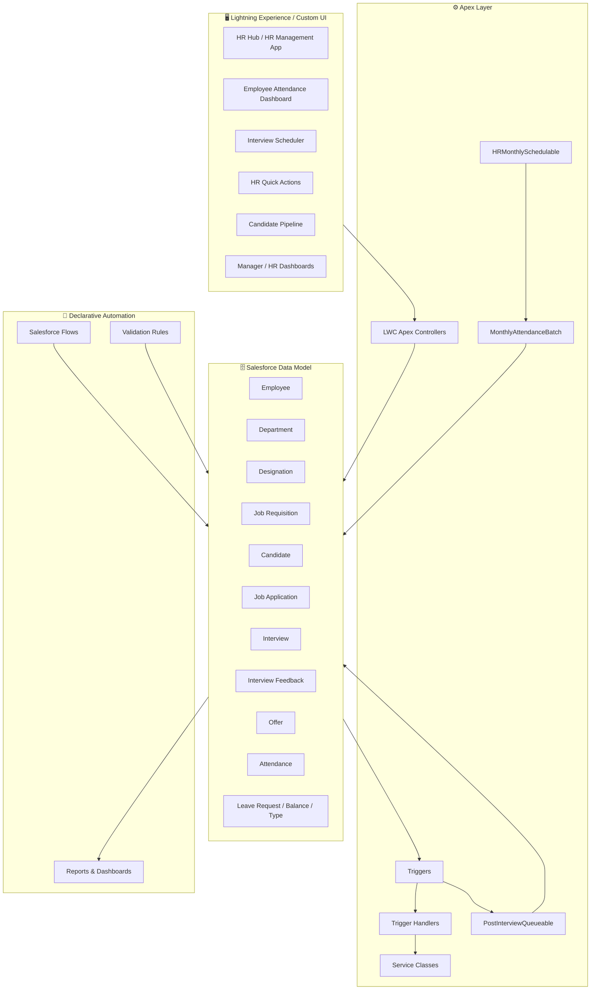
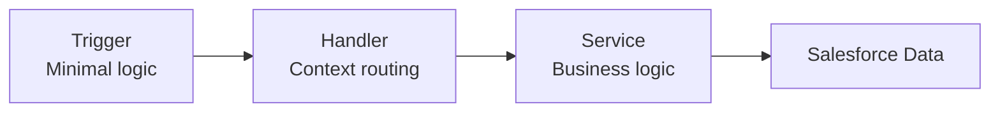
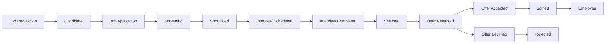

<div align="center">

# 🧑‍💼 HR Work Management & Employee Operations System

### A Salesforce-based HR platform for employee management, recruitment, interviews, attendance, leave, onboarding, and HR operations

[](https://www.salesforce.com/)
[](https://developer.salesforce.com/docs/atlas.en-us.apexcode.meta/apexcode/)
[](https://developer.salesforce.com/docs/platform/lwc/overview)
[](https://help.salesforce.com/s/articleView?id=sf.flow.htm)
[]

**A portfolio project demonstrating Salesforce Administration, Automation, Security, Apex Development, Asynchronous Apex, Lightning Web Components, Reporting, and deployment practices.**

</div>

---

## 📌 Overview

The **HR Work Management & Employee Operations System** is a custom HR application built on Salesforce to bring common HR processes into one centralized platform.

The project covers the employee lifecycle from **recruitment and interview scheduling to offer management, joining, attendance, leave, onboarding, and HR reporting**.

Instead of relying on disconnected spreadsheets and manual processes, the system uses Salesforce objects, relationships, validation rules, Flow, Apex, Lightning Web Components, reports, dashboards, role hierarchy, sharing, and permission sets.

### Core Modules

| Module                         | What it provides                                                                         |
| ------------------------------ | ---------------------------------------------------------------------------------------- |
| 👤 **Employee Management**     | Employees, departments, designations, managers, employment information and work location |
| 🏢 **Organization Management** | Departments, designations and reporting relationships                                    |
| 🎯 **Recruitment**             | Job requisitions, candidates, applications and recruitment pipeline                      |
| 🗓️ **Interview Management**   | Interview scheduling, rounds, interviewers, meeting links and feedback                   |
| 📄 **Offer Management**        | Offer release, acceptance/decline and candidate status automation                        |
| 🚀 **Onboarding**              | Candidate-to-employee joining process and welcome communication                          |
| 🕐 **Attendance**              | Daily attendance, duplicate protection and attendance reporting                          |
| 🌴 **Leave Management**        | Leave types, balances, requests, approvals and cancellations                             |
| 📊 **Reports & Dashboards**    | Recruitment, attendance, leave, interview and employee reporting                         |
| ⚙️ **Automation**              | Salesforce Flow, validation rules, Apex triggers and asynchronous Apex                   |
| 🔐 **Security**                | Role hierarchy, OWD, sharing and permission sets                                         |
| 🖥️ **Custom UI**              | Lightning Web Components for dashboards, scheduling and recruitment                      |

> **Guiding principle:** use declarative Salesforce tools first and use Apex when the requirement genuinely benefits from bulk processing, complex logic, aggregation, asynchronous processing or custom UI integration.

---

# 🏗️ Architecture



## Trigger Architecture

The Apex trigger implementation follows a:

**Trigger → Handler → Service**

pattern.



### Why this pattern?

* Keeps triggers small and readable
* Separates trigger context from business logic
* Makes classes easier to test
* Supports bulk-safe processing
* Improves maintainability

---

# 🗂️ Data Model

The application uses custom Salesforce objects to represent the HR lifecycle.

### Organization & Employees

* Department
* Designation
* Employee
* Work Shift
* Holiday

### Recruitment

* Job Requisition
* Candidate
* Job Application
* Interview
* Interview Feedback
* Offer

### Attendance & Leave

* Attendance
* Leave Type
* Leave Balance
* Leave Request

### HR Operations

* Onboarding
* Performance Review
* Goal

---

# 🔄 Recruitment Lifecycle



### Job Application Stages

1. Applied
2. Screening
3. Shortlisted
4. Interview Scheduled
5. Interview Completed
6. Selected
7. Rejected
8. Offer Released
9. Offer Accepted
10. Offer Declined
11. Joined

---

# 👤 Employee Management

Employee records contain HR information including:

* Employee ID
* Employee Name
* Email
* Phone
* Department
* Designation
* Manager
* Joining Date
* Employment Type
* Employment Status
* Work Location
* CTC / compensation information
* Experience
* Skills

### Employment Type

* Full Time
* Part Time
* Intern
* Contractual

### Work Location

* Office
* Remote
* Hybrid

Employee ID is generated using an Auto Number field.

---

# 🗓️ Interview Management

The Interview object supports:

* Candidate
* Job Application
* Interviewer
* Interview Date
* Start Time
* End Time
* Meeting Link
* Mode of Interview
* Round
* Status
* Notes

### Interview Modes

* Online
* Offline
* Phone

### Interview Rounds

* HR
* Technical
* Managerial
* Final

### Interview Status

* Scheduled
* Completed
* Cancelled
* Rescheduled
* No Show

### Validation Rules

The system validates that:

* Interview end time must be after start time.
* Interview date cannot be in the past when creating or changing the interview date.

---

# 📝 Interview Feedback

Interview Feedback captures:

* Comments
* Communication Skills
* Technical Skills
* Interview Feedback
* Interviewer Rating
* Recommendation
* Strengths
* Weaknesses

### Recommendation Values

* Strongly Hire
* Hire
* Hold
* No Hire

Interview feedback can automatically drive the Job Application stage.

---

# 🌴 Leave Management

The leave module contains:

* Leave Type
* Leave Balance
* Leave Request

### Leave Request Status

* Draft
* Submitted
* Approved
* Rejected
* Cancelled

### Leave Balance

Tracks:

* Employee
* Leave Type
* Year
* Allocated Days
* Used Days
* Remaining Days

```text
Remaining Days = Allocated Days - Used Days
```

### Leave Duration

```text
Leave Duration = End Date - Start Date + 1
```

Flows update leave balances when requests are approved or cancelled after approval.

---

# 🕐 Attendance Management

The Attendance module supports daily employee attendance.

### Attendance Status

* Present
* Absent
* Leave
* Late
* Work From Home

The system includes:

* Duplicate attendance protection
* Working-hours calculations
* Monthly attendance percentage
* Low-attendance reporting
* Employee attendance dashboard
* Manager/HR attendance visibility
* Bulk-safe Apex processing

---

# ⚙️ Salesforce Automation

The project uses Salesforce Flow for declarative automation and Apex where code provides a clear advantage.

### Important Flows

* Set New Job Application to Applied
* Move Job Application to Screening
* Set Interview Scheduled Stage
* Set Interview Completed Stage
* Set Job Application Stage from Interview Feedback
* Set Job Application Stage to Offer Released
* Set Job Application Stage to Offer Accepted
* Set Job Application Stage to Offer Declined
* Job Application - Joined
* Job Application - Offer Declined
* Leave Request - Approved
* Leave Request - Cancelled After Approved
* Create Draft Flow Approval Process
* Candidate Joined / Employee creation
* Candidate welcome communication
* Interview scheduled/completed notifications
* Offer released notification

---

# 🔐 Security & Access Control

Security was designed using Salesforce's standard security model.

## Role Hierarchy

```text
CEO
├── CFO
├── COO
└── HR Head
    └── Department Manager
        └── Employee
```

An HR Manager is positioned at the management level appropriate for HR access.

## Organization-Wide Defaults

Private access is used for sensitive objects such as:

* Attendance
* Candidate
* Employee
* Leave Request

Other operational objects use Public Read/Write where appropriate for the project design.

### Security Features

* Role hierarchy
* Organization-Wide Defaults
* Sharing configuration
* Permission sets
* Manager access
* HR access
* Controlled employee information access
* Protection of sensitive compensation information

---

# 📊 Reports & Dashboards

The project includes reporting for major HR functions.

### Recruitment

* Job Applications
* Recruitment Pipeline
* Open Requisitions
* Candidate Status

### Interviews

* Upcoming Interviews
* Completed Interviews
* Interview Status

### Attendance

* Employee Attendance
* Monthly Attendance Percentage
* Low-Attendance Employees

### Leave

* Leave Requests
* Pending Approvals
* Leave Balances
* Approved / Rejected / Cancelled Requests

### HR Dashboard

The HR dashboard provides visibility into:

* Recruitment Pipeline
* Upcoming Interviews
* Pending Leave Approvals
* HR Requests
* Low Attendance
* Open Requisitions

---

# 🚀 Apex Development

## Phase 19 — Apex Triggers

### Employee

```text
EmployeeTrigger
    ↓
EmployeeTriggerHandler
    ↓
EmployeeService
```

Responsibilities:

* Trim employee email
* Lower-case email
* Detect duplicate emails
* Detect duplicates within the same transaction

### Interview

```text
InterviewTrigger
    ↓
InterviewTriggerHandler
    ↓
InterviewService
```

Responsibilities:

* Validate scheduled interviews
* Ensure required scheduling information

### Attendance

```text
AttendanceTrigger
    ↓
AttendanceTriggerHandler
    ↓
AttendanceService
```

Responsibilities:

* Prevent duplicate attendance for employee/date
* Working-hours helper logic
* Monthly attendance calculations

## Bulkification

The Apex implementation follows Salesforce bulkification principles:

* Process `Trigger.new` as a collection
* No SOQL inside loops
* No DML inside loops
* Use Maps and Sets
* Query records once where possible

### Bulk Test

A 200-record Attendance insertion was tested successfully using:

```text
2 SOQL queries out of the 100-query limit
```

---

# ⚡ Phase 20 — Advanced Apex

## Batch Apex

### `MonthlyAttendanceBatch`

Processes the previous month's attendance for employees in chunks.

Features:

* Batch processing
* Aggregate attendance calculations
* Chunk size of 200
* `Database.Stateful`

### Result

```text
Completed
0 failures
```

---

## Queueable Apex

### `PostInterviewQueueable`

The Queueable process demonstrates chained asynchronous processing:

```text
Notify
  ↓
Update
  ↓
Log
```

Each step executes in its own transaction.

Partial-success DML is used where appropriate:

```apex
Database.update(records, false);
```

---

## Scheduled Apex

### `HRMonthlySchedulable`

Starts the monthly attendance batch.

Cron expression:

```text
0 0 1 1 * ?
```

This schedules the process for **1:00 AM on the first day of every month**.

---

# 🖥️ Phase 21 — Lightning Web Components

The project includes **five custom Lightning Web Components**.

| Component                     | Location              | Main Techniques                                                        |
| ----------------------------- | --------------------- | ---------------------------------------------------------------------- |
| `employeeAttendanceDashboard` | Employee Record Page  | `@wire`, cacheable Apex, `@api recordId`, progress bar, month selector |
| `interviewScheduler`          | HR Hub App Page       | Imperative Apex, `setCustomValidity`, toast messages, custom events    |
| `hrQuickActions`              | HR Hub App Page       | `NavigationMixin`, Lightning Message Channel                           |
| `candidatePipeline`           | Candidate Record Page | LDS, `getRecord`, `updateRecord`, `getPicklistValues`, Path            |
| `managerTeamDashboard`        | HR Hub App Page       | Multiple `@wire`, `refreshApex`, record navigation                     |

### Component UX

Every component handles:

* Loading state
* Empty state
* Error state
* User-friendly messages

---

# 🧪 Testing & Validation

Testing was performed throughout the project.

### Testing Areas

* Flow debugging
* Interview scheduling validation
* Leave approval/cancellation
* Candidate-to-employee joining
* Offer acceptance/decline
* Email notifications
* Attendance duplicate protection
* 200-record bulkification
* Batch Apex execution
* Queueable execution
* Scheduled Apex
* LWC live-data rendering
* Security and role visibility

---

# 🧩 Technical Challenges Solved

### API Name Mismatch

A compile error occurred due to a field API name mismatch:

```text
Attendence_Date__c
```

vs.

```text
Attendance_Date__c
```

The correct API name was verified from Salesforce Object Manager.

### Queueable + Validation Rule

A Queueable update initially failed because of the Interview past-date validation rule.

The solution used:

```apex
Database.update(records, false);
```

and adjusted the validation rule so that it fires when creating or changing the interview date.

### Bulkification

The project was tested with **200 Attendance records** instead of only single-record testing.

### Email Automation

Interview, offer and candidate lifecycle email notifications were tested using Salesforce email automation and an Organization-Wide Email Address.

---

# 🪜 Project Phases

### Phases 1–10 — Foundation & Core HR Automation

Covered:

* Salesforce Developer Org
* HR custom objects
* Relationships
* Fields and formulas
* Page layouts
* Compact layouts
* Lightning Record Pages
* Dynamic Forms
* Employee management
* Recruitment
* Interview management
* Leave management
* Attendance
* Validation rules
* Reports and dashboards
* Flow automation
* Email notifications
* Candidate joining

### Phase 11 — Security

Implemented:

* Role hierarchy
* OWD
* Permission sets
* Sharing/access requirements
* Manager and HR access
* Sensitive information protection

### Phases 12–18 — Advanced Automation & Apex Foundation

Covered:

* Advanced Flow automation
* Cross-object business logic
* HR reporting improvements
* Apex service architecture
* Lists, Sets and Maps
* Bulk-safe processing
* Exception-handling concepts
* HR service classes

### Phase 19 — Apex Triggers

Implemented:

* Employee Trigger
* Interview Trigger
* Attendance Trigger
* Trigger Handler pattern
* Service layer
* Bulkification

### Phase 20 — Advanced Apex

Implemented:

* Batch Apex
* Queueable Apex
* Scheduled Apex

### Phase 21 — Lightning Web Components

Implemented:

* Employee Attendance Dashboard
* Interview Scheduler
* HR Quick Actions
* Candidate Pipeline
* Manager Team Dashboard

### Phase 22+

Additional advanced Salesforce development and portfolio/deployment work is continuing.

---

# 📁 Repository Structure

```text
hr-work-management-system/
│
├── force-app/
│   └── main/
│       └── default/
│           ├── classes/
│           ├── triggers/
│           ├── lwc/
│           ├── objects/
│           ├── flows/
│           ├── permissionsets/
│           ├── layouts/
│           ├── flexipages/
│           └── tabs/
│
├── docs/
│   └── images/
│       ├── hr-hub-app-page.png
│       ├── apex-jobs.png
│       ├── soql-200-records.png
│       ├── flow-1.png
│       ├── flow-2.png
│       └── data-model.png
│
├── README.md
└── sfdx-project.json
```

---

# 🚀 Setup & Deployment

## Prerequisites

* Salesforce Developer Edition org or Sandbox
* Salesforce CLI (`sf`)
* VS Code with Salesforce Extension Pack
* Git
* GitHub account

## Clone Repository

```bash
git clone https://github.com/farhanimdad/hr-work-management-system.git
cd hr-work-management-system
```

## Authenticate

```bash
sf org login web --alias hr-org
```

## Deploy

```bash
sf project deploy start --source-dir force-app --target-org hr-org
```

## Run Apex Tests

```bash
sf apex run test --target-org hr-org --result-format human --code-coverage
```

## Schedule Monthly Attendance Processing

Run in Anonymous Apex:

```apex
System.schedule(
    'Monthly Attendance Processing',
    '0 0 1 1 * ?',
    new HRMonthlySchedulable()
);
```

---

# 🔄 Source Control & Deployment

| Area                  | Change Sets | Salesforce CLI + Git |
| --------------------- | ----------- | -------------------- |
| Version control       | ❌           | ✅                    |
| Repeatable deployment | Limited     | ✅                    |
| Code review           | Limited     | ✅                    |
| Collaboration         | Limited     | ✅                    |
| Rollback              | Difficult   | Git-based            |
| Team workflow         | Basic       | Strong               |

Deployment order:

```text
Objects & Fields
      ↓
Apex Classes
      ↓
Triggers
      ↓
Lightning Web Components
      ↓
Pages & Permissions
```

---

# 🧠 Skills Demonstrated

| Area                          | Skills                                                                                |
| ----------------------------- | ------------------------------------------------------------------------------------- |
| **Salesforce Administration** | Custom objects, fields, relationships, page layouts, Dynamic Forms, Lightning pages   |
| **Data Modeling**             | HR relational data model, lookups, formulas and validation                            |
| **Flow**                      | Record-triggered automation, cross-object updates, stage management and notifications |
| **Security**                  | OWD, role hierarchy, sharing and permission sets                                      |
| **Reporting**                 | Reports, dashboards, recruitment, attendance and leave analytics                      |
| **Apex**                      | Classes, triggers, handlers, services and collections                                 |
| **Bulkification**             | Lists, Sets, Maps, bulk SOQL/DML and governor-limit awareness                         |
| **Async Apex**                | Batch, Queueable and Scheduled Apex                                                   |
| **LWC**                       | `@wire`, imperative Apex, LDS, custom events, message channels and NavigationMixin    |
| **Testing**                   | Flow debugging, Apex execution, bulk tests and asynchronous jobs                      |
| **DevOps**                    | Salesforce CLI, Git and GitHub                                                        |

---

# 💡 Interview Notes

### Why Flow before Apex?

Flow handles straightforward declarative business rules efficiently. Apex is used when requirements involve complex logic, large data volumes, aggregation, asynchronous processing or custom UI integration.

### Why Trigger → Handler → Service?

It separates trigger context, routing and business logic, improving readability, testing and maintainability.

### How was bulkification proven?

A 200-record Attendance transaction was executed and monitored using governor-limit information. The test used only **2 SOQL queries out of the 100-query limit**.

### Why Batch Apex?

Monthly attendance processing benefits from large-volume processing, chunked execution, aggregate queries and Apex Jobs monitoring.

### Why Queueable Apex?

Queueable Apex supports chained asynchronous processing where different steps can execute in separate transactions with fresh governor limits.

### `@wire` vs Imperative Apex

`@wire` is useful for reactive and cacheable data retrieval.

Imperative Apex is useful for user-triggered actions such as saving an interview.

### Why Lightning Data Service?

LDS provides a standard Salesforce mechanism for reading and updating records from LWC without unnecessary custom Apex.

---

# 📸 Screenshots

Recommended repository screenshots:

```text
docs/images/hr-hub-app-page.png
docs/images/apex-jobs.png
docs/images/soql-200-records.png
docs/images/flow-1.png
docs/images/flow-2.png
docs/images/data-model.png
```

> 🔒 Blur or replace real people's names, email addresses and other personal information before publishing screenshots.

---

# 🎯 Portfolio Highlights

This project demonstrates practical experience with:

* Salesforce Administration
* Salesforce Flow
* Apex
* Trigger Handler architecture
* Service-layer design
* Batch Apex
* Queueable Apex
* Scheduled Apex
* Lightning Web Components
* Lightning Data Service
* Lightning Message Channel
* NavigationMixin
* Role hierarchy
* Sharing and permissions
* Reports and dashboards
* Bulkification
* Governor-limit awareness
* Salesforce CLI
* Git/GitHub

The project is designed as an **end-to-end HR management application**, rather than a collection of isolated Salesforce exercises.

---

# 👤 Author

## Farhan Imdad

**B.Tech — Information Technology**

Salesforce-focused fresher with hands-on project experience in:

* Salesforce Administration
* Apex
* Lightning Web Components
* Flow
* Salesforce Security
* Reports & Dashboards
* Git/GitHub

### GitHub

[@farhanimdad](https://github.com/farhanimdad)

---

<div align="center">

### ⭐ If you find this project useful, consider giving the repository a star.

**Built with Salesforce ⚡**

</div>
